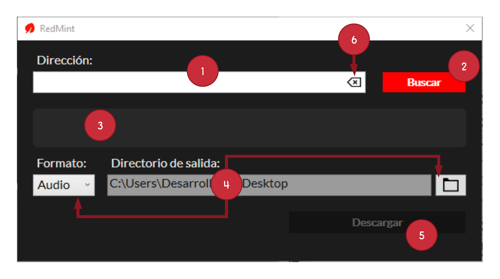

# RedMint_UI
Aplicacion de escritorio WPF en .NET Core 3.0

Esta pequeña aplicacion permite descargar audio y video de YouTube, utilizando un [fork](https://github.com/LinPolly/YoutubeExtractor) de la libreria [YoutubeExtractor](https://github.com/flagbug/YoutubeExtractor).

1. Al abrir la aplicacion, debera ingresar la URL del video que quiera descargar.
2. Una vez ingresado, presione el boton **Buscar** para que la aplicacion busque el video en youtube.
3. Si el video existe, entonces se mostrara el titulo del video y se habilitara el boton de descarga.
4. Seleccione el *formato* (Audio o Video), el *directorio de salida* (Escritorio/ por defecto).
5. Presione el boton **Descargar**. Una vez termine la descarga, se desplegara un mensaje indicando que la descarga ha sido completada.
6. Presione el boton **Vaciar Campo** para escribir y buscar una nueva URL.